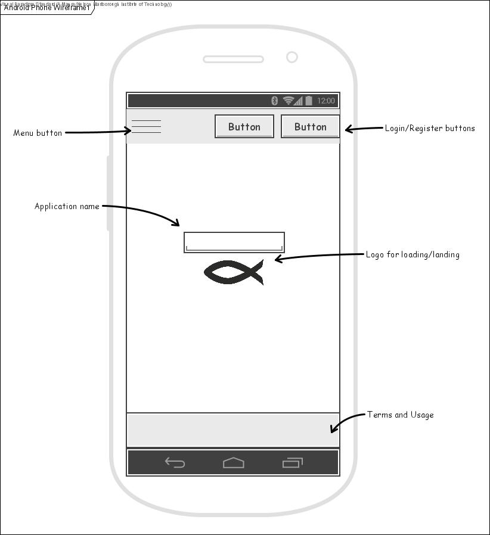
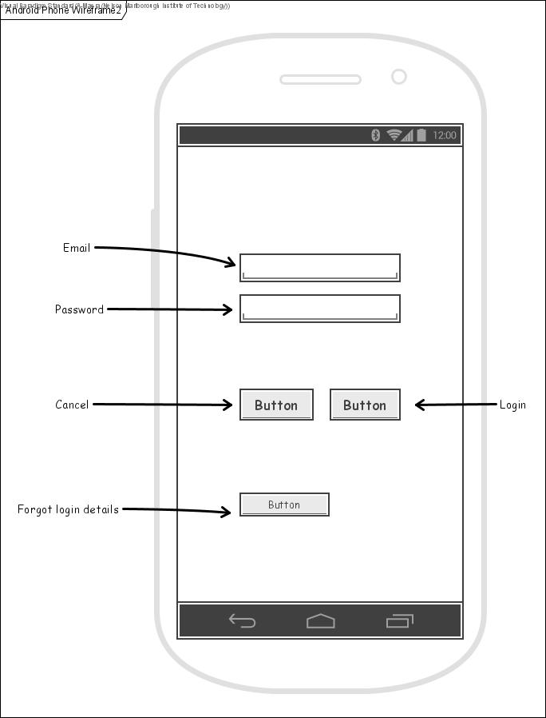
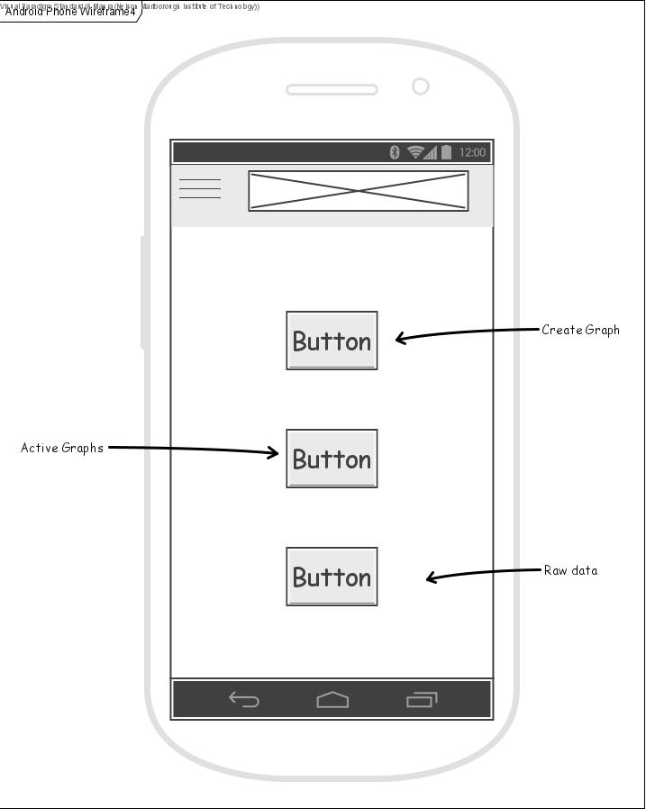
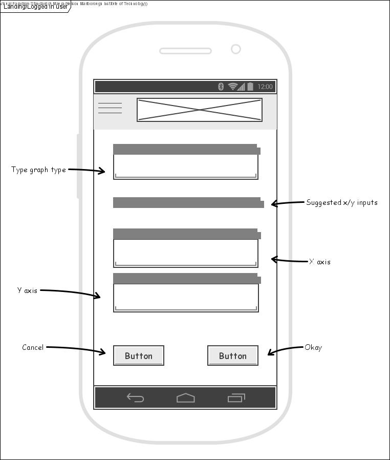
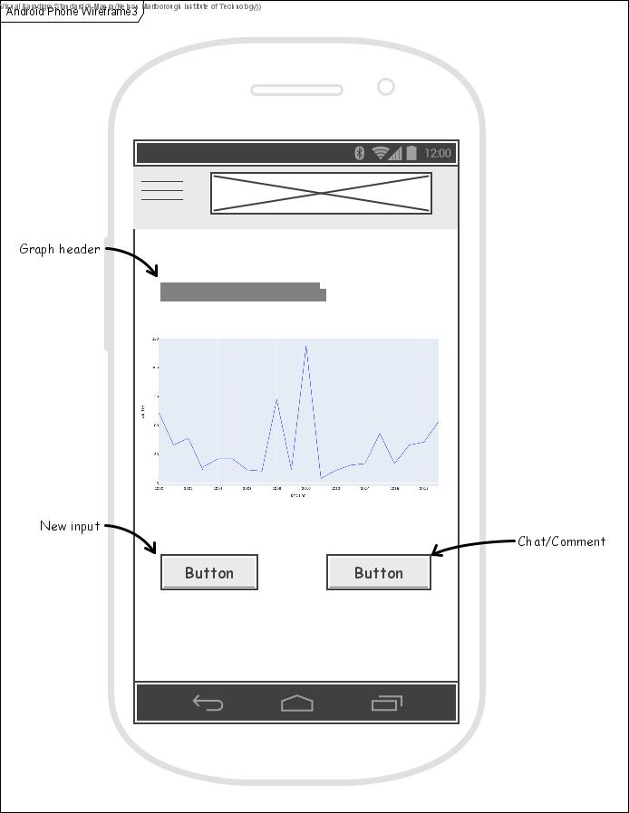
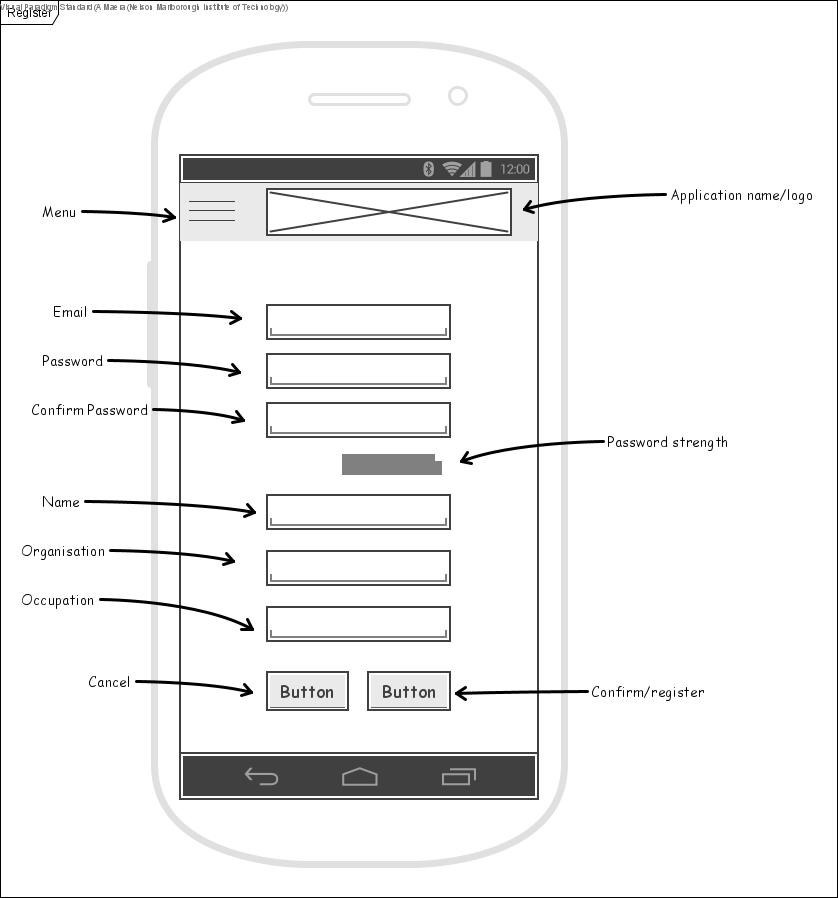

	SDV602 APPLICATION PROJECT
| Project Name:       | Oceania Fisheries App - Fishiees   |
| ------------------- | ---------------------------------- |
| **Due Date:**       |                                    |
| Milestone One:      | 27/08/2021                         |
| Milestone Two:      | Week Nine                          |
| Milestone Three:    | Week Fifteen                       |
| **Participants**    |                                    |
| Name                | Asti Maera                         |
| Role                | Creator                            |
| Contact information | 0221692165 ~ asti-maera@nmit.ac.nz |

This document is a detailed description of the application, it’s parts and datasets used to create it. 

####   Project Requirements

1. Provide a graphical interface for analysing specified datasets for scientific or business purposes. 
2. Allow for interaction and control of displayed data through text-based input from the user.
3. Allow for interaction and control of displayed data through click and point input from the user.
4. Provide a live chat system for users through remote http-based API.  

#### Project Overview

Using datasets from FishStatJ (aggregated data from FAO – Fisheries and Agricultural Organisation of the United Nations - http://www.fao.org/fishery/statistics/software/fishstatj/en) provide an interface that allows for more easily digestible comparisons of capture and production rates for Oceania, with the potential to also provide and compare export and import statistics for these countries using the Commodities 1976-2018 datasets in the future. 
The current displays available for FishStatJ use the existing csv files to display the information in a spreadsheet.

The data viewable is able to be manipulated by continent, fish species or type, tonnage as well as geographical and economical factors. The new application would include these factors and display a series of graphs for the selected sorted data, depending on the chosen inputs of the user.
Constraints have been set to limit the available views to countries in the Oceania region as well as reducing the years of data available to post 2000.

#### Wireframe Storyboard

Opening Screen for Fishiees Application 

User goes to login, login screen loads and provides inputs for credentials

User enters correct credentials is logged in and returned to logged in landing page.

User clicks "Create Graph"

User enters required input for graph and then selects "Okay". Graph is returned with required data.

User is able to return to the previous input page to create a new graph or manipulate existing data.

##### Miscellaneous

Registration page

